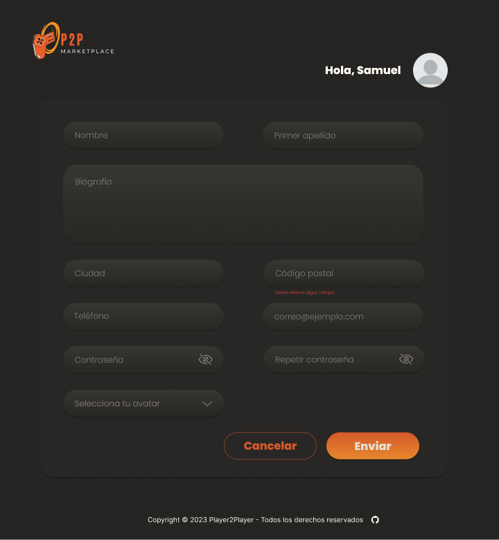

# **P2P - Player2Player**
   
## **Descripción del Proyecto:**
**_P2P - Player2Player_** es una plataforma en línea diseñada para la **compra** y **venta** de videojuegos, consolas y PCs de segunda mano. La plataforma permite a los usuarios buscar productos, registrarse para obtener acceso completo, publicar sus propios productos y llevar a cabo transacciones seguras. El proyecto consta de un frontend interactivo y un backend robusto.
   
A continuación se describen las **principales funcionalidades** del proyecto con las respectivas imágenes del wireframe, empezando por la pantalla de inicio:

 

## **Funcionalidades para Usuarios Anónimos:**

1. **Búsqueda de productos:**
   
- Los usuarios anónimos pueden buscar explorar productos y buscar productos utilizando varios criterios, como nombre, categoría, localidad y rango de precio, para encontrar productos de su interés.

 

2. **Ver el perfil de otros usuarios:**

- Los usuarios anónimos pueden ver los perfiles de los usuarios, incluyendo los productos que estos tienen a la venta, las opiniones que han dejado otros usuarios sobre compras que le hayan hecho y los datos de contacto y biografía en caso de que el vendedor los quiera proporcionar.

 

1. **Autenticación:**

- Los usuarios anónimos pueden registrarse para obtener una cuenta en la plataforma con un mínimo de datos requeridos.

 

- Se envía un correo electrónico de confirmación con un código para activar la cuenta antes de permitir el inicio de sesión. 

 

  

- Una vez la cuenta ha sido activada, los usuarios pueden iniciar sesión y acceder a todos los servicios que proporciona la plataforma.

 
  

## **Funcionalidades para Usuarios Registrados:**

1. **Gestión del Perfil:**

- Los usuarios registrados tienen la capacidad de gestionar su perfil, lo que incluye la modificación de sus datos de registro, y la posibilidad de agregar tanto datos de contacto, como su dirección, biografía y una foto de perfil personalizada, si así lo desea.

 

2. **Publicación de Nuevos productos:**

- Los usuarios registrados pueden publicar sus propios productos en la plataforma, proporcionando información detallada, como nombre, imagen, descripción, categoría, precio y localidad de venta.

 

3. **Proceso de Reserva de productos:**

- Cuando un comprador está interesado en un artículo, puede realizar una propuesta de compra al vendedor a través de la plataforma.

 

- El vendedor recibe la propuesta de compra por correo electrónico y a través de un elace que le lleva a la pantalla de Solicitudes de compra, tiene la opción de aceptarla o rechazarla.

 

- Una vez aceptada la propuesta de compra, el vendedor selecciona un lugar y hora para la entrega.

 

- El comprador recibe una notificación por correo electrónico si la compra es aceptada, incluyendo detalles de la hora y lugar de entrega.

 

- Cuando el vendedor acepta un pedido, se envía un correo electrónico automático al resto de interesados para informarles de que el producto ya no se encuentra disponible

 

1. **Ver/Gestionar pedidos:**

- A través de la pantalla de pedidos, los usuarios pueden ver todos los pedidos que han realizado y el estado de estos.

 

- En el caso de los pedidos aceptados, podrá comprobar el lugar y hora de entrega definido por el vendedor.

 

1. **Valoraciones:**

- Después de la entrega exitosa de un artículo, el comprador tiene la opción de valorar al vendedor en la plataforma, proporcionando feedback sobre la experiencia y una calificación de 1 a 5.

 

## **Gestión de Errores:**

## **Funcionalidades del Backend:**

1. **Base de Datos:**
   - Se crea una base de datos para almacenar información sobre usuarios, productos, pedidos y valoraciones.

2. **Servidor Express:**
   - Se utiliza Express para crear el servidor de la aplicación, gestionando solicitudes y respuestas HTTP.

3. **Conexión con la Base de Datos:**
   - Se establece una conexión segura entre el servidor Node.js y la base de datos para almacenar y recuperar datos de manera eficiente.

4. **Middlewares:**
   - Se implementa un middleware que se encarga de autentificar al usuario que intenta hacer uso de las funcionalidades de la plataforma que requieren autenticación.

5. **Helpers:**
   - Se crean funciones auxiliares que se encargan de realizar tareas de manejo de imágenes, validaciones y gestión de errores.

6. **Endpoints API:**
   - Se crean endpoints API para las siguientes funciones:
     - Registro e inicio de sesión de usuarios.
     - Listado de productos, incluyendo información del vendedor y valoración media de éste.
     - Visualización detallada de un artículo, con información y valoración media del vendedor.
     - Filtros avanzados para la búsqueda de productos por nombre, categoría, localidad y rango de precio.
     - Creación de nuevos productos.
     - Actualización de perfiles de usuarios.
     - Propuestas de compra y confirmación de compras.
     - Valoraciones de vendedores por parte de los compradores.

7. **Documentación:**
   - Se crea una documentación detallada en un archivo README.md, que incluye una descripción de la aplicación, instrucciones paso a paso para ejecutar el proyecto y un listado completo de los endpoints API disponibles, así como una colección de Postman para testear dichos endpoints en la carpeta docs del proyecto.

## **Notas Adicionales:**
   - Se implementa validación de datos en todos los endpoints utilizando Joi para garantizar la integridad de la información en la base de datos.
   - Se establecen medidas de seguridad sólidas para proteger la información de los usuarios mediante el uso de JWT (JSON Web Token) y bcrypt.
  
